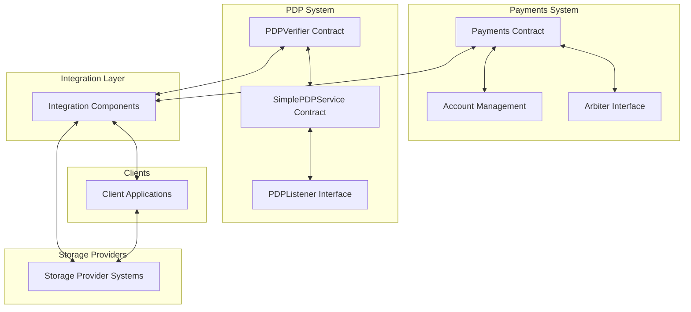
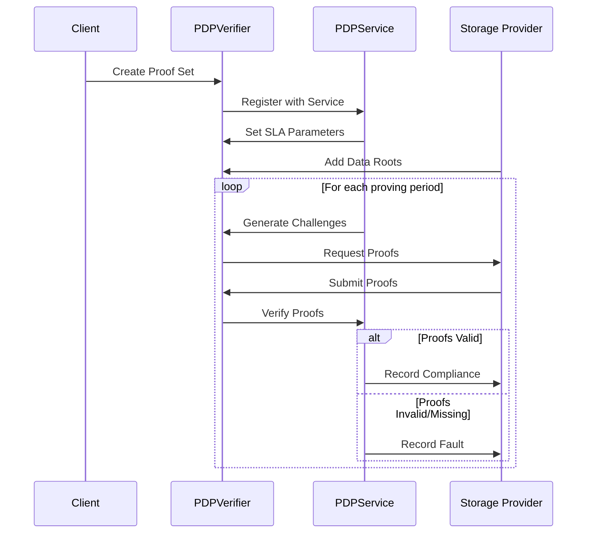
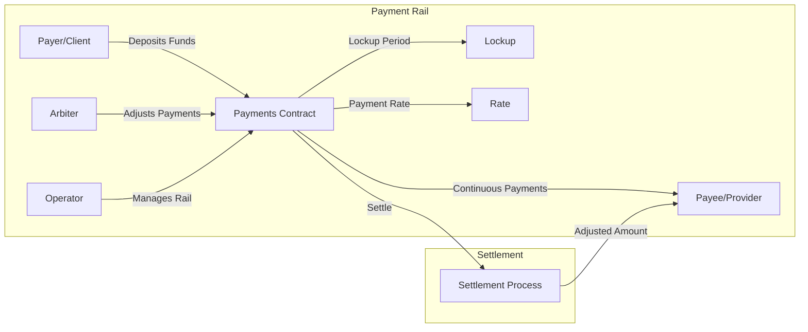
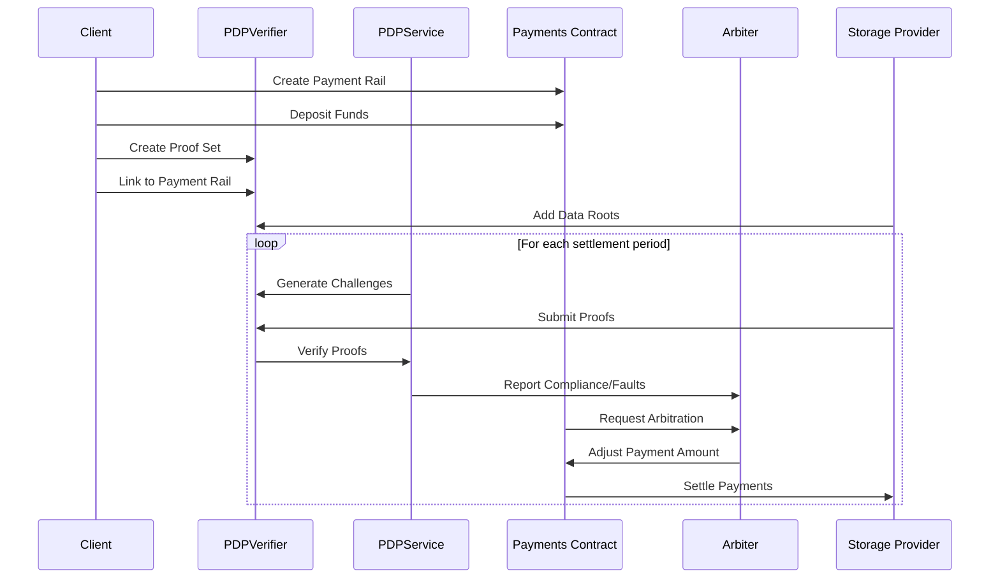
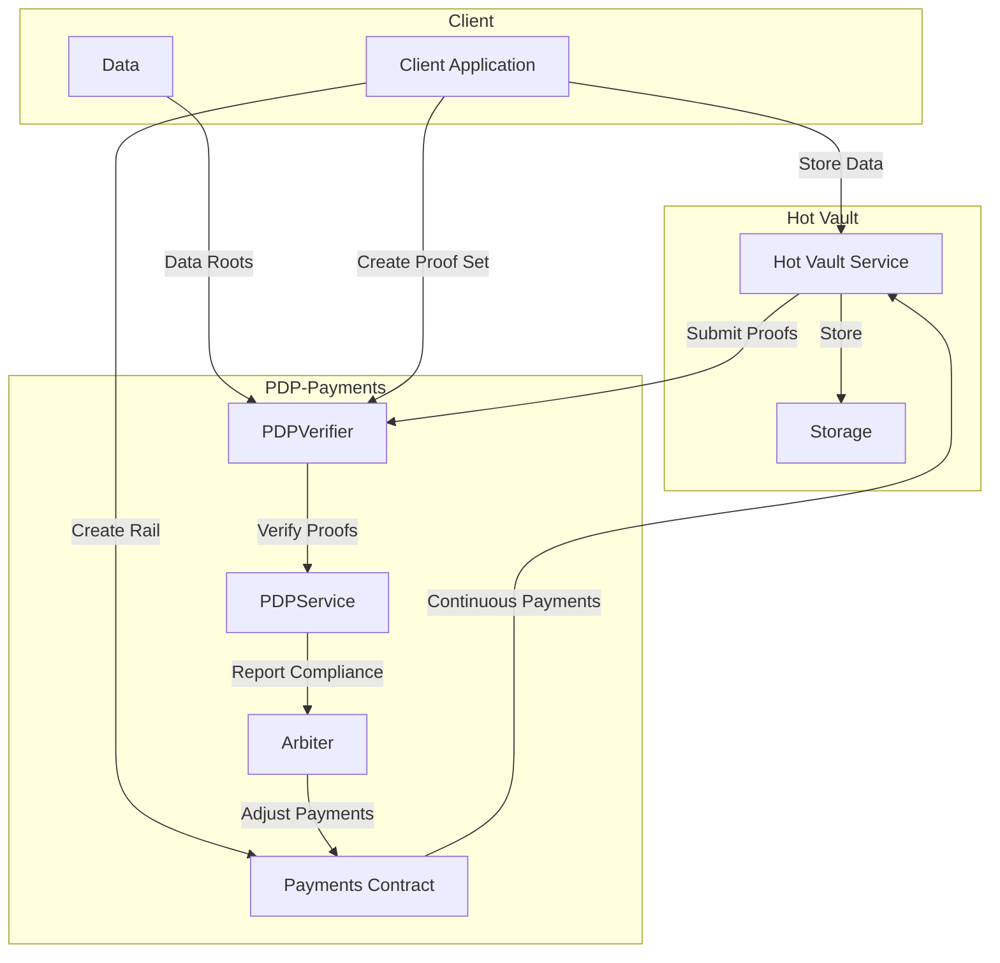
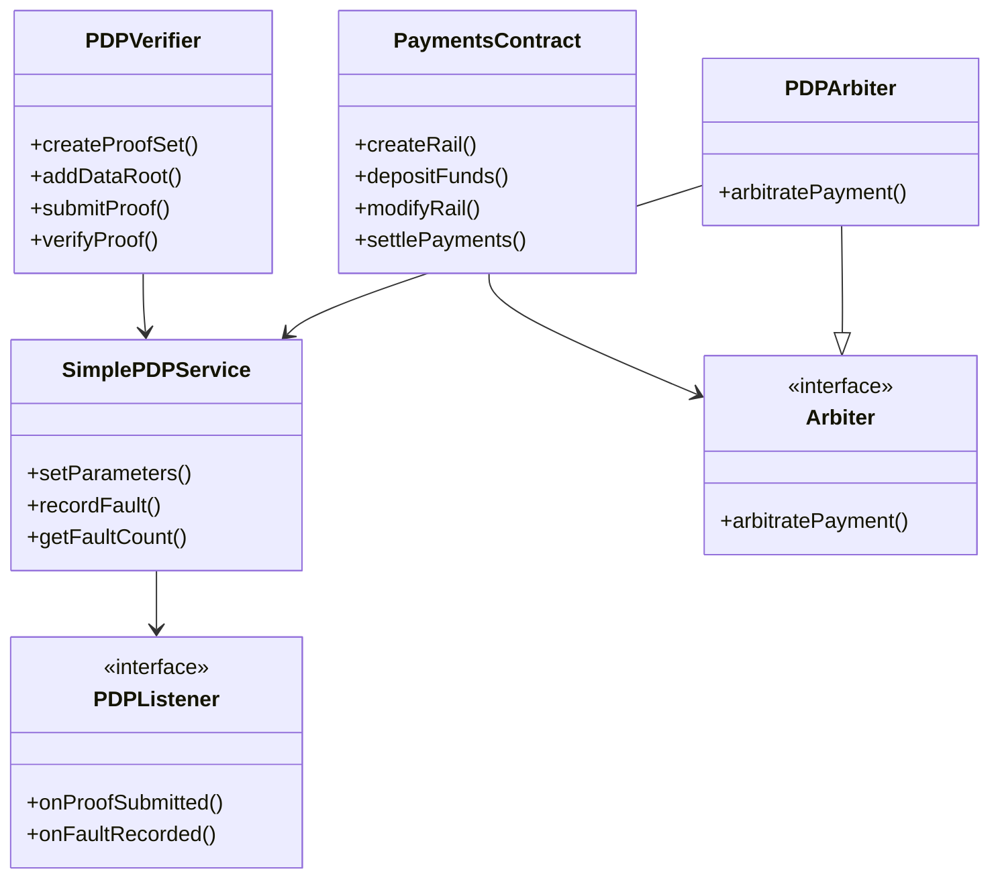

# PDP-Payments (FWS) System Diagrams

This page contains various diagrams that illustrate the architecture and workflows of the PDP-Payments (FWS) system.

## System Architecture

The diagram above shows the overall architecture of the PDP-Payments (FWS) system, including the relationships between the PDP components, Payment components, and their integration.

## PDP Workflow

This diagram illustrates the workflow of the Provable Data Possession (PDP) system, from proof set creation to verification.

## Payment Rails

This diagram shows how payment rails connect payers and payees, with arbitration for SLA enforcement.

## Integration Workflow

This diagram demonstrates how the PDP and Payments systems integrate to provide verifiable storage with automatic payment adjustments.

## Hot Vault Example

This diagram shows the Hot Vault example implementation, which demonstrates how PDP-Payments (FWS) can be used for hot storage with continuous payments.

## Component Relationships

This diagram shows the relationships between the various components of the PDP-Payments (FWS) system, including contracts, interfaces, and services.

## Note on Diagrams

These diagrams are provided for illustrative purposes. The actual implementation may vary slightly. For the most accurate and up-to-date information, please refer to the corresponding documentation pages and the source code.

The diagrams are created using [Mermaid](https://mermaid-js.github.io/mermaid/), a JavaScript-based diagramming and charting tool that renders Markdown-inspired text definitions to create diagrams dynamically.
