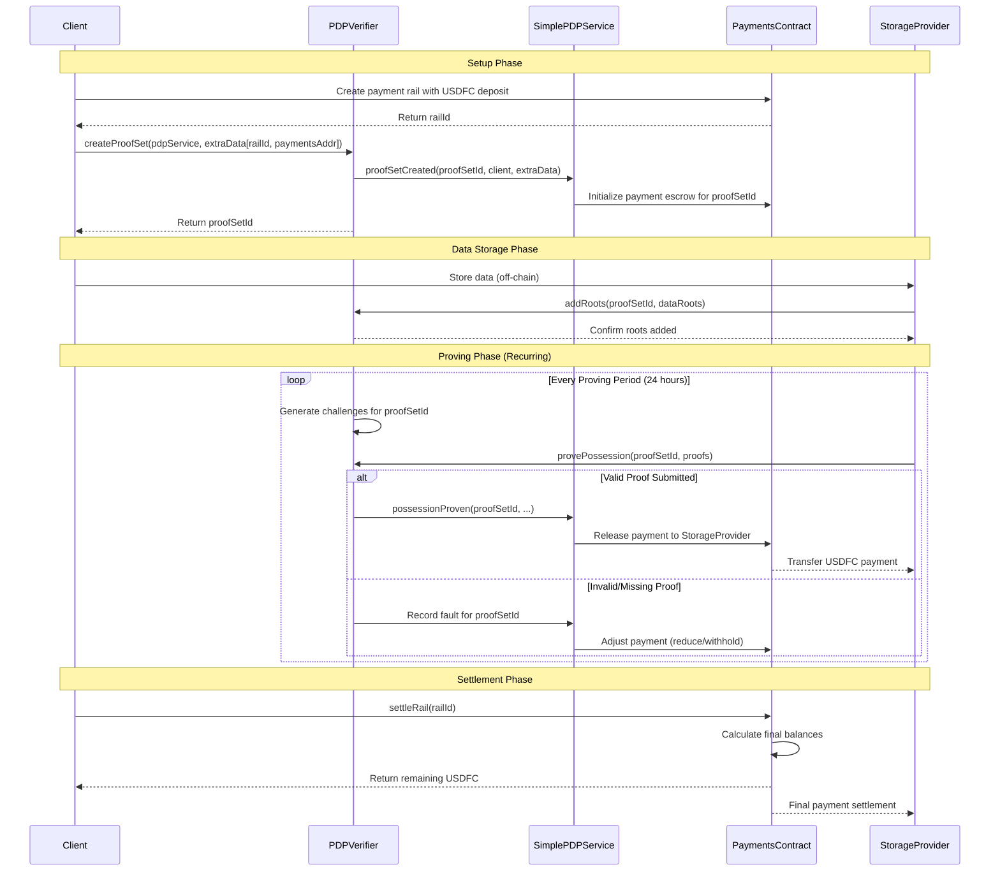

# Provable Data Possession (PDP) System

## Overview

Provable Data Possession (PDP) is a cryptographic protocol that allows a client to verify that a storage provider still possesses the data they claim to be storing, without having to download the entire dataset. This is particularly important in decentralized storage networks like Filecoin, where clients need assurance that their data is being stored correctly over time.

The PDP system provides a robust implementation of this protocol on the Filecoin network, enabling verifiable storage with customizable Service Level Agreements (SLAs).

## Key Features

- **Efficient Verification**: Verify data possession without retrieving the entire dataset
- **Customizable SLAs**: Define specific proof frequency and requirements
- **Fault Detection**: Automatically detect when storage providers fail to prove possession
- **Integration with Payments**: Connect proof compliance with payment adjustments
- **Scalable Architecture**: Handle multiple proof sets and storage providers

## Core Components

### PDPVerifier Contract

The central contract that manages proof sets and verifies proofs. It:
- Creates and manages proof sets
- Generates challenges for storage providers
- Verifies submitted proofs
- Tracks compliance with SLA terms

```solidity
function createProofSet(address listenerAddr, bytes calldata extraData) public payable returns (uint256)
```

**Parameters:**
- `listenerAddr`: Address of the PDP service contract (e.g., SimplePDPService)
- `extraData`: Additional data to be passed to the listener (often contains payment information)

**Returns:**
- `uint256`: The ID of the newly created proof set

**Example:**
```javascript
// Encode payment information in extra data
const extraData = ethers.utils.defaultAbiCoder.encode(
    ['uint256', 'address'],
    [railId, paymentsContractAddress]
);

// Calculate the sybil fee
const sybilFee = await pdpVerifier.sybilFee();

// Create a proof set
const tx = await pdpVerifier.createProofSet(
    pdpServiceAddress,
    extraData,
    { value: sybilFee }
);

// Get the proof set ID from the event logs
const receipt = await tx.wait();
const proofSetId = receipt.events[0].args.setId;
```

### SimplePDPService Contract

Implements the SLA terms for the PDP system:
- Defines proof frequency (maximum proving period)
- Specifies the challenge window during which proofs must be submitted
- Determines the number of challenges required per proof
- Records faults when proofs are missed or invalid

```solidity
function getMaxProvingPeriod() public pure returns (uint64)
```

**Returns:**
- `uint64`: The maximum number of epochs between proofs (typically 2880, approximately 1 day)

```solidity
function getChallengeWindow() public pure returns (uint64)
```

**Returns:**
- `uint64`: The number of epochs at the end of a proving period during which proofs must be submitted

```solidity
function getFaultCount(uint256 proofSetId, uint256 fromEpoch, uint256 toEpoch) external view returns (uint256)
```

**Parameters:**
- `proofSetId`: The ID of the proof set
- `fromEpoch`: The starting epoch for the fault count
- `toEpoch`: The ending epoch for the fault count

**Returns:**
- `uint256`: The number of faults recorded for the proof set in the specified epoch range

### PDPListener Interface

An interface that allows for extensible applications to use the PDP verification contract:
- Notifies when proof sets are created or deleted
- Reports when roots are added or scheduled for removal
- Informs when possession is proven
- Signals the start of a new proving period

```solidity
interface PDPListener {
    function proofSetCreated(uint256 proofSetId, address creator, bytes calldata extraData) external;
    function possessionProven(uint256 proofSetId, uint256 challengedLeafCount, uint256 seed, uint256 challengeCount) external;
    // Additional functions...
}
```

## System Flow Diagram

The following sequence diagram illustrates the complete flow of data and payments through the PDP system, from initial setup through settlement:



## How It Works

### 1. Creating a Proof Set

A client creates a proof set in the PDPVerifier contract, specifying which SLA contract to use and providing signed payment information.

```javascript
// Create a proof set with payment information
async function createProofSet(pdpServiceAddress, railId, paymentsAddress) {
    // Encode payment information
    const extraData = ethers.utils.defaultAbiCoder.encode(
        ['uint256', 'address'],
        [railId, paymentsAddress]
    );
    
    // Get the sybil fee
    const sybilFee = await pdpVerifier.sybilFee();
    
    // Create the proof set
    const tx = await pdpVerifier.createProofSet(
        pdpServiceAddress,
        extraData,
        { value: sybilFee }
    );
    
    const receipt = await tx.wait();
    return receipt.events[0].args.setId;
}
```

### 2. Adding Data

The storage provider adds data roots to the proof set, which represent the data they're storing.

```javascript
// Add data roots to a proof set
async function addRoots(proofSetId, cid, dataSize) {
    // Prepare the root data
    const rootData = [{
        root: {
            version: 1,
            codec: 0x71, // dag-cbor
            hash: 0x12, // sha2-256
            size: 32,
            data: cidBytes // Bytes representation of the CID
        },
        rawSize: dataSize
    }];
    
    // Add the roots to the proof set
    const tx = await pdpVerifier.addRoots(
        proofSetId,
        rootData,
        "0x" // No extra data
    );
    
    await tx.wait();
}
```

### 3. Challenge Generation

The system generates random challenges based on the data in the proof set.

### 4. Submitting Proofs

The storage provider must submit valid proofs within specific time windows.

```javascript
// Submit proofs for a proof set
async function submitProofs(proofSetId) {
    // Get the next challenge epoch
    const nextChallengeEpoch = await pdpVerifier.getNextChallengeEpoch(proofSetId);
    
    // Wait until the challenge epoch
    // ... (implementation depends on your environment)
    
    // Generate proofs for the challenges
    const proofs = await generateProofs(proofSetId);
    
    // Calculate the proof fee
    const proofFee = await pdpVerifier.calculateProofFee(proofSetId, estimatedGasFee);
    
    // Submit the proofs
    const tx = await pdpVerifier.provePossession(
        proofSetId,
        proofs,
        { value: proofFee }
    );
    
    await tx.wait();
}
```

### 5. Verification

The PDPVerifier contract verifies the submitted proofs.

### 6. Fault Recording

If a storage provider fails to submit valid proofs on time, the system records a fault.

## Deployed Contracts

The PDP service contract and the PDP verifier contracts are deployed on Filecoin Mainnet and Calibration Testnet.

**Mainnet**
- **PDP Verifier**: `0x9C65E8E57C98cCc040A3d825556832EA1e9f4Df6`
- **PDP Service**: `0x805370387fA5Bd8053FD8f7B2da4055B9a4f8019`

**Calibration Testnet**
- **PDP Verifier**: `0x5A23b7df87f59A291C26A2A1d684AD03Ce9B68DC`
- **PDP Service**: `0x6170dE2b09b404776197485F3dc6c968Ef948505`

## Integration with Payments

The PDP system integrates with the [Payments system](payments-overview.md) through:

1. **Arbiter Contracts**: These contracts use fault records from the PDP system to determine payment adjustments.

2. **Payment Rails**: Payments flow from clients to storage providers through these rails, with adjustments based on PDP compliance.

3. **Settlement**: When a rail is settled, the arbiter can reduce payments for providers who have failed to meet their PDP obligations.

For a detailed guide on integrating PDP with Payments, see [Integrating PDP with Payments](integration/pdp-payments.md).

## Security Considerations

The PDP system includes several security features:

- **Challenge Finality Delay**: Prevents randomness manipulation by storage providers
- **Sybil Fees**: Prevents spam attacks on the system
- **Proof Fees**: Compensates for verification costs
- **Cryptographic Verification**: Ensures proofs are valid and correspond to the correct data

## Next Steps

- Learn about the [Payments System](payments-overview.md)
- Understand how to [Integrate PDP with Payments](integration-guide.md)
- Follow the [Quick Start Guide](quick-start.md)
- Explore the [Hot Vault Example](examples/hot-vault.md)
