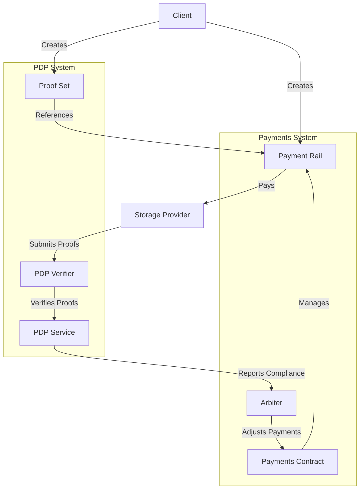
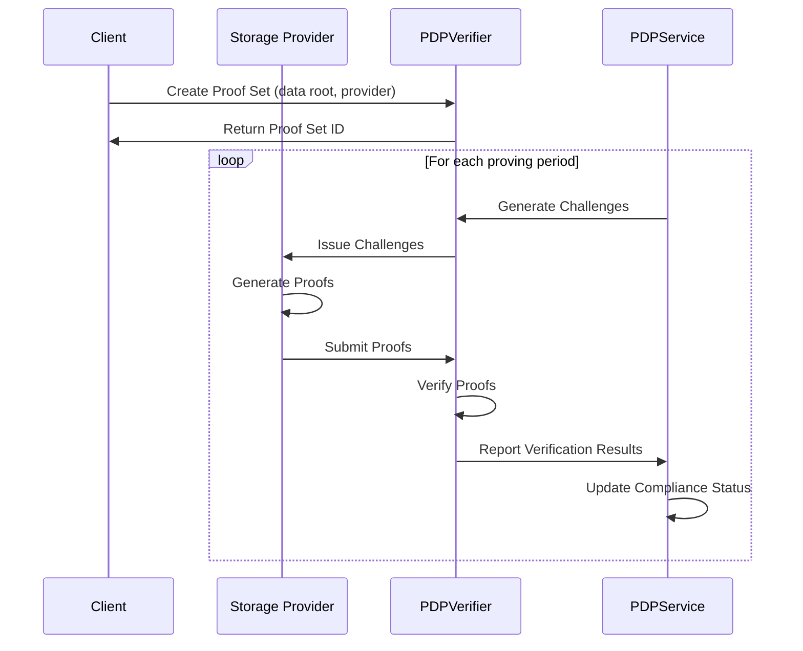
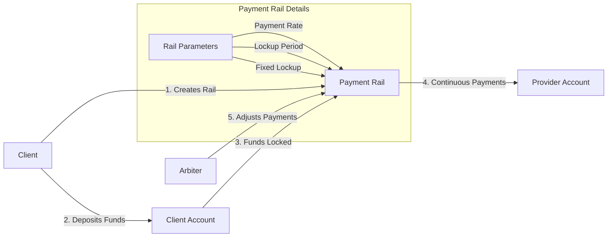
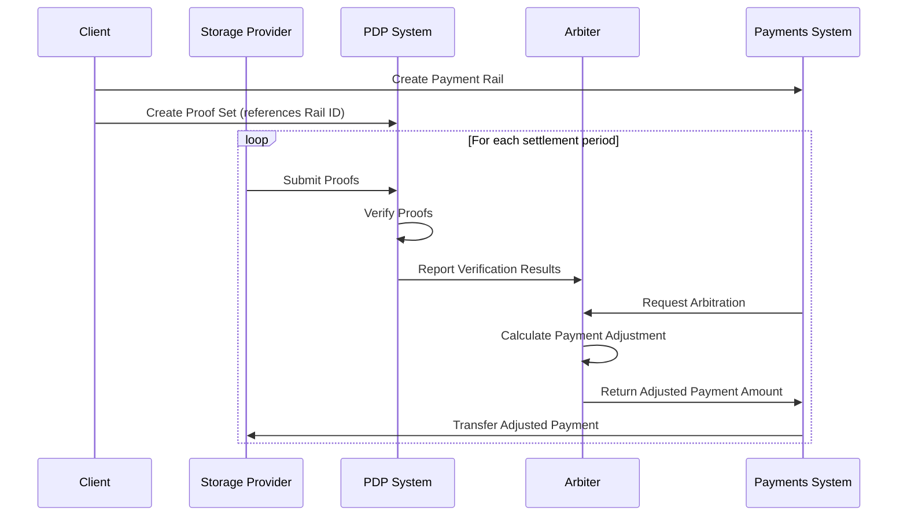
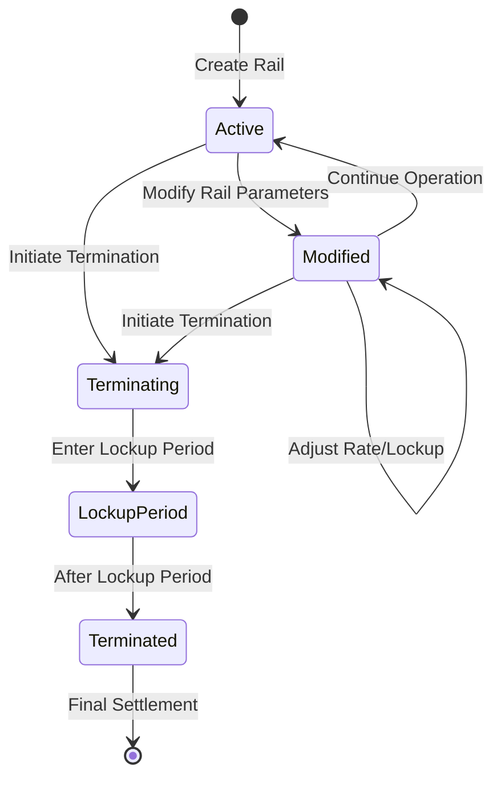
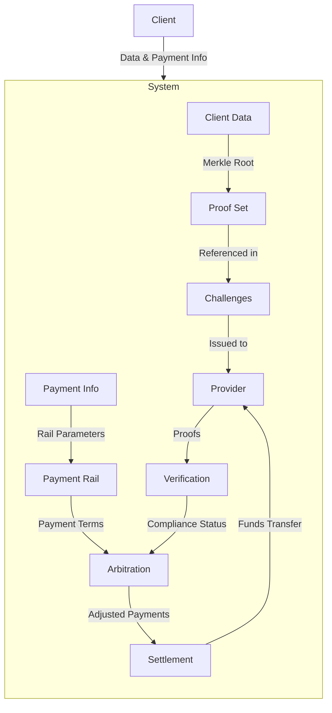

# PDP-Payments (FWS) System Diagrams

This document provides visual representations of the PDP-Payments (FWS) system architecture and workflows to help understand how the system components interact.

## 1. System Architecture Overview

**Summary:**
This diagram illustrates the high-level architecture of the PDP-Payments (FWS) system. The client creates both a payment rail and a proof set, linking them together. The storage provider submits proofs to the PDP Verifier, which works with the PDP Service to verify the proofs. The PDP Service reports compliance to the Arbiter, which adjusts payments through the Payments Contract based on the provider's performance. This creates a closed loop where payment flows are directly tied to proof of data possession.

## 2. PDP Verification Flow

**Summary:**
This sequence diagram shows the PDP verification flow. The client first creates a proof set in the PDP Verifier, specifying the data root and the storage provider. For each proving period, the PDP Service generates challenges that are issued to the provider. The provider generates proofs based on these challenges and submits them to the PDP Verifier. The verifier checks the proofs and reports the results to the PDP Service, which updates the compliance status. This cycle repeats throughout the duration of the storage agreement, ensuring continuous verification of data possession.

## 3. Payment Rails Workflow

**Summary:**
This diagram illustrates how payment rails work in the system. The client creates a payment rail, specifying parameters such as payment rate, lockup period, and fixed lockup amount. The client deposits funds into their account, which are then locked in the rail based on the specified parameters. The rail facilitates continuous payments to the provider at the configured rate. An arbiter can adjust these payments based on service delivery (such as proof compliance). This creates a flexible payment channel that automatically handles ongoing payments while enforcing service level agreements.

## 4. PDP-Payments Integration Flow

**Summary:**
This sequence diagram shows how PDP and Payments systems integrate. The client creates a payment rail in the Payments System and a proof set in the PDP System, linking them together. During each settlement period, the provider submits proofs to the PDP System, which verifies them and reports the results to the Arbiter. When the Payments System requests arbitration, the Arbiter calculates payment adjustments based on the verification results and returns the adjusted payment amount to the Payments System. The Payments System then transfers the adjusted payment to the provider. This integration ensures that payments are directly tied to the provider's compliance with the data possession requirements.

## 5. Rail Modification and Termination

**Summary:**
This state diagram illustrates the lifecycle of a payment rail. A rail starts in the Active state when created. It can be modified by adjusting parameters like payment rate or lockup requirements, transitioning to the Modified state and back to Active during normal operation. When termination is initiated, the rail enters the Terminating state, followed by the Lockup Period where payments continue based on the lockup parameters. After the lockup period ends, the rail transitions to the Terminated state, and a final settlement is performed. This flexible lifecycle allows for adjustments to payment terms and orderly termination of payment channels.

## 6. Data Flow in PDP-Payments System

**Summary:**
This flowchart shows the data flow within the PDP-Payments system. The client provides both data (which is represented by a Merkle root in the proof set) and payment information (which defines the rail parameters). The system issues challenges based on the proof set to the provider, who responds with proofs. These proofs undergo verification, resulting in a compliance status that feeds into the arbitration process. The arbitration process considers both the compliance status and the payment terms from the rail to determine adjusted payments. The settlement process then transfers the appropriate funds to the provider. This integrated data flow ensures that payments are directly tied to verifiable data possession.
